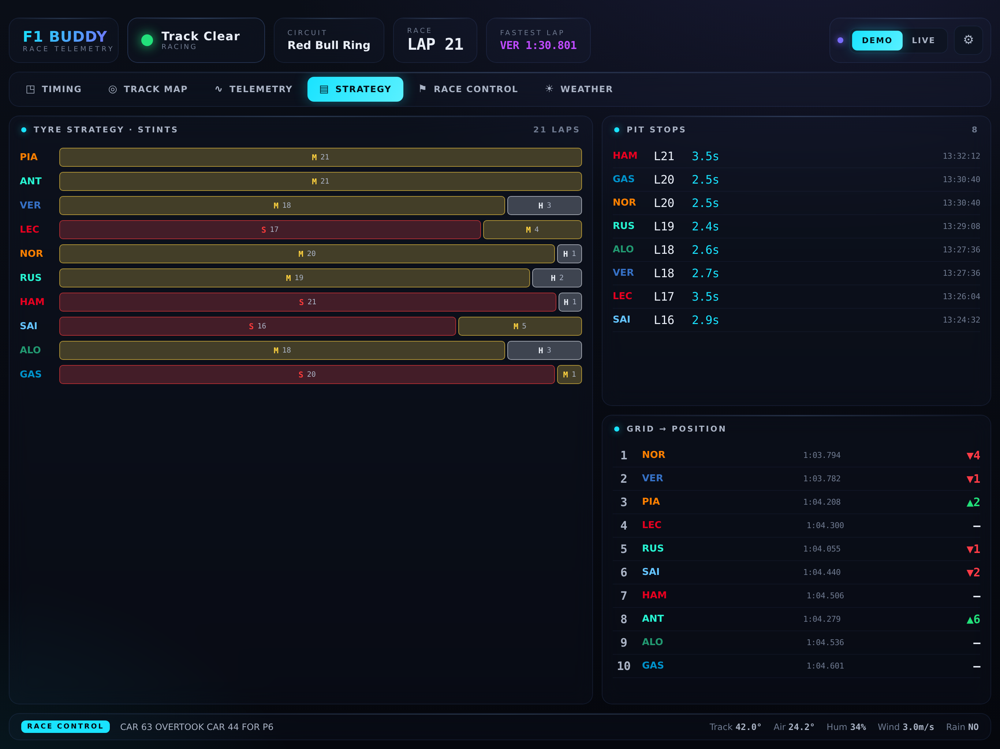

# F1 Buddy 🏎️

A futuristic, data-dense **race-companion dashboard built for iPad in landscape**.
Run it on a second screen while you watch a Formula 1 race and get a live timing
feed similar to the F1 broadcast — gaps, tyres, stints, sectors and lap-time
analysis — rendered in a clean, dark, animated UI.



## Views

A landscape tab bar switches between six full-screen views, each surfacing a
different slice of the OpenF1 feed:

1. **Timing** — the live timing tower (status, tyres + age, stint length, last
   lap, interval & leader gaps, computed sector performance, per-row lap-time
   trend) alongside the configurable **Lap-Time Analysis** panel.
2. **Track Map** — every car's live position on the circuit (`location`), with
   DRS zones highlighted and a glow ring when a car has DRS open.
3. **Telemetry** — per-driver `car_data`: speed, RPM, gear, throttle, brake and
   DRS, with a live speed trace. Compare up to four drivers side by side.
4. **Strategy** — a tyre-stint Gantt timeline, the pit-stop log with stationary
   times, starting **grid → current position** deltas, and the final
   classification (`session_result`) once the flag drops.
5. **Race Control** — the full `race_control` message log with coloured flags,
   an `overtakes` feed, and `team_radio` clips with in-app playback.
6. **Weather** — current conditions plus trend charts for track/air temp,
   humidity and wind.

## Features

- **Race state** — status banner (green / yellow / SC / VSC / red / chequered),
  current lap, circuit, session and live race-control messages.
- **Tyres, stints & strategy** — compound + tyre age per driver, current stint
  length, and a full stint Gantt with pit-stop history.
- **Last lap & lap-time series** — highlighted PB (green) / session-fastest
  (purple), a per-row sparkline, and a multi-driver comparison chart with a
  configurable window (5 / 6 / 7 / 10 laps) and rolling averages.
- **Gaps** — interval to the car ahead **and** gap to the leader (lapped cars
  handled).
- **Sector performance** — S1/S2/S3 coloured as overall fastest / personal best
  / slower, **computed from sector durations** because OpenF1's mini-sector
  colours are unavailable during races.
- **Car telemetry** — speed, RPM, gear, throttle, brake, DRS and speed traces.
- **Track positions, overtakes, team radio, grid, results and weather** — every
  remaining OpenF1 data set, each with a dedicated visualisation.

## Data source

Powered by the free, open [OpenF1 API](https://openf1.org/) (`api.openf1.org/v1`).
**Every** OpenF1 endpoint is consumed: `meetings`, `sessions`, `drivers`,
`intervals`, `position`, `laps`, `stints`, `pit`, `race_control`, `weather`,
`car_data`, `location`, `team_radio`, `overtakes`, `starting_grid` and
`session_result`.

- **Historical data (2023+) is free** and needs no key.
- **True real-time timing requires a paid OpenF1 subscription.** Add your key in
  **Settings → API Key** and it is sent as a `Bearer` token. You can also point
  the base URL at your own authenticated proxy.

### Modes

- **Demo** *(default)* — a fully offline race simulator that produces
  OpenF1-shaped data and runs through the exact same rendering pipeline as live
  data. Great for trying the UI when no race is on (≈4 real seconds per lap).
- **Live** — polls a real session. Set the session to `latest` for whatever is
  currently running, or paste a specific OpenF1 `session_key` to replay a past
  race. Order/gaps refresh every ~4.5 s; laps/stints/flags every ~12 s. The
  high-frequency `car_data`/`location` feeds are polled (~2 s, recent-window
  bounded) only while the Track Map or Telemetry view is open.

## Running it

```bash
npm install
npm run dev      # http://localhost:5173
```

Open it on the iPad's browser in landscape and (optionally) **Add to Home
Screen** for a full-screen, chrome-free experience.

### Build

```bash
npm run build    # type-check + production bundle into dist/
npm run preview  # serve the production build
```

## Tech

- **React + TypeScript + Vite**
- **Framer Motion** for the animated, position-swapping timing tower and panels
- Hand-built **SVG** charts/sparklines for full control of the look
- A single design-token CSS layer (`src/styles/global.css`)

## Project layout

```
src/
  api/          OpenF1 client + raw/derived types
  data/sim.ts   offline race simulator (Demo mode)
  store/        polling + state orchestration (useRaceData)
  utils/        formatting + the derivation pipeline (raw -> view model)
  components/    Header, TimingTower, LapAnalysis, LapChart, Ticker, Settings…
```

The key idea: **all data — live or simulated — is normalised by
`utils/derive.ts` into a single `RaceSnapshot`** that the components render.
